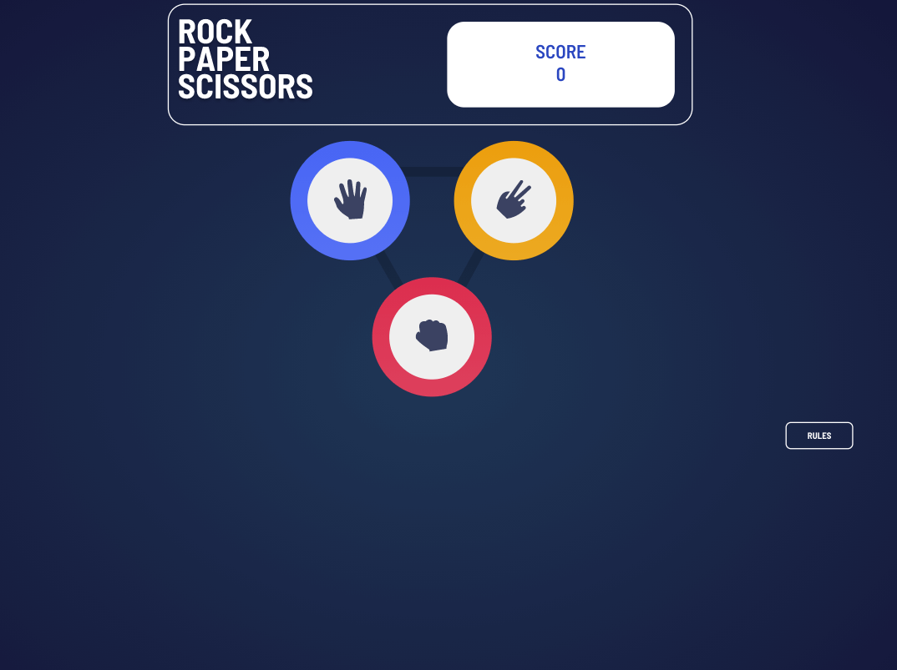
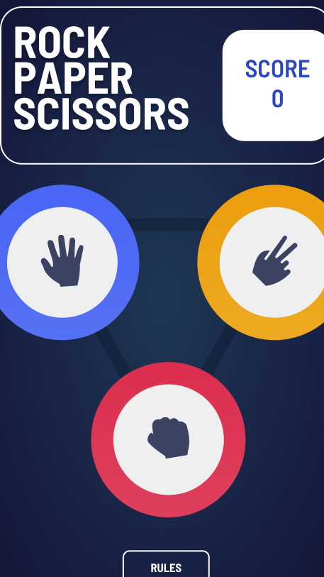

# Frontend Mentor - Rock, Paper, Scissors solution

This is a solution to the [Rock, Paper, Scissors challenge on Frontend Mentor](https://www.frontendmentor.io/challenges/rock-paper-scissors-game-pTgwgvgH). Frontend Mentor challenges help you improve your coding skills by building realistic projects. 

## Table of contents

- [Overview](#overview)
  - [The challenge](#the-challenge)
  - [Screenshot](#screenshot)
  - [Links](#links)
- [My process](#my-process)
  - [Built with](#built-with)
  - [What I learned](#what-i-learned)
  - [Continued development](#continued-development)
  - [Useful resources](#useful-resources)

## Overview

### The challenge

Users should be able to:

- View the optimal layout for the game depending on their device's screen size
- Play Rock, Paper, Scissors against the computer
- Maintain the state of the score after refreshing the browser _(optional)_
- **Bonus**: Play Rock, Paper, Scissors, Lizard, Spock against the computer _(optional)_

### Screenshot

### Links

- Live Site URL: [Github Pages](https://jdegand.github.io/rock-paper-scissors)

## My process

### Built with

- CSS custom properties
- Flexbox
- Grid

### What I learned

- Tried to use name attribute to get choice but was inconsistent and empty string would be registered -  background conflict? 
- Don't add a dot when using classList() - very easy to do even when you know better

### Continued development

- Using transform: scale() on the winner class makes the inner circle have the color of the circle gradient. 
- SetTimeout() could cause unexpected results.
- Accessibility / Improved Semantic HTML

### Useful resources

- [W3 Schools](https://www.w3schools.com/howto/howto_css_modals.asp) - Modal
- [Go Make Things](https://gomakethings.com/hidden-content-for-better-a11y/#hiding-the-link)
- [Blog](https://web.archive.org/web/20200929210549/https://paulund.co.uk/how-to-create-different-shapes-in-css) - CSS shapes
- [Codepen](https://codepen.io/MattWindle/pen/perZRG) - 2 x 2 Grid